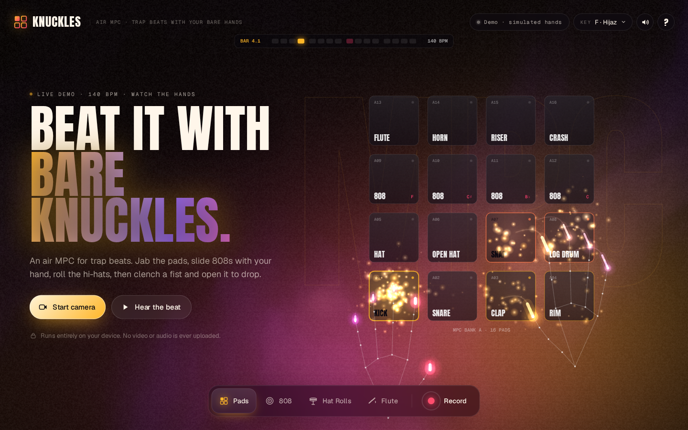
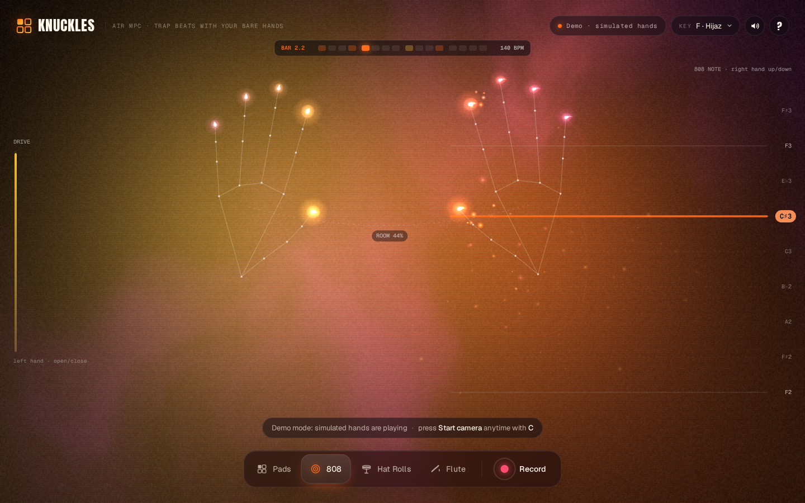
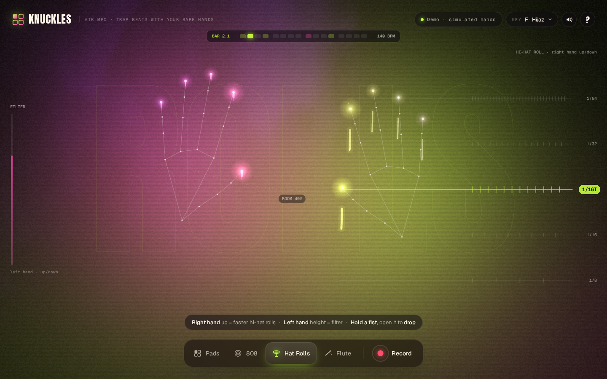

# Knuckles

**An air MPC for trap beats. You play it with your bare hands.**



**Live demo: https://chris-wozniczek.github.io/knuckles/**

Knuckles uses your webcam to turn your hands into an MPC-style drum machine. Aim a ring cursor between your thumb and index at the 16 pads and pinch to hit them, slide gliding 808s up and down with your right hand, speed up hi-hat rolls, then clench a fist and open it to drop the beat. A trap beat plays underneath (four to pick from), and every note snaps to the beat's key, F Hijaz by default.

It's a companion to [Handel](https://github.com/chris-wozniczek/handel), the same idea done as a calm air orchestra.

## How to use

1. Open the live demo. The attract screen already plays a beat with simulated hands. Press **Hear the beat** to turn the sound on.
2. Press **Start camera** (on the attract screen, or top right while the demo plays, or `C`) and allow access. Step back about an arm's length and keep both hands in frame.
3. Pick a mode in the dock (or press keys `1`–`4`):

| Mode | What your hands do |
| --- | --- |
| **Pads** | The point between your thumb and index tips is a ring cursor: put it over a pad and pinch to hit. Only pinches fire pads, so moving around, fists and stray knuckles never trigger anything. Bottom row: kick, snare, clap, rim. Then hats and log drum, four 808 notes, and flute, horn, riser and crash on top. |
| **808** | Right-hand height picks the 808 note, with glide. Pinch adds an extra hit, left-hand openness adds drive, a fist hits the kick. |
| **Hat Rolls** | Raise your right hand to go from 1/8 to 1/64 hi-hat rolls. Left-hand height sweeps the filter. Hold a fist to cut the beat and open it to **drop**. |
| **Flute** | Right-hand height plays a tribal flute lead over the beat. Pinch adds an accent, left-hand openness adds vibrato, a fist hits a boom. |

Pick the groove with the **Beat** menu (or press `B`): **Tribal Trap** (140 BPM, flute hook), **Brooklyn Drill** (142, dark choir, sliding 808s, skippy hats), **West Coast Keys** (93, staccato piano stabs, G-funk bounce) or **Late Night** (128, sad guitar plucks, long gangsta 808s). Each beat sets its own tempo, groove and key. All four are original patterns written for Knuckles.

**Use your own sounds.** Open **Sounds** (top right) and click any pad to load an audio file onto it (WAV, MP3, OGG, M4A…), or just drag a file onto a pad on screen. Load a **background loop** the same way (or drop a file anywhere off the pads): it shows up in the Beat menu as **Your Loop**, and its tempo is guessed from its length so the pads and hat rolls stay in time. Your files are kept in this browser (IndexedDB) so they're still there next visit; **Reset pads** and **Remove** clear them.

Moving your hands apart makes the room (reverb) bigger. Press **Record** (or `R`) for a 15-second clip with sound, ready to post. Press `?` for help at any time.

| | |
| --- | --- |
|  |  |

## How it works

- **Hand tracking:** MediaPipe Tasks Vision `HandLandmarker` runs in the browser (WASM + GPU delegate, falling back to CPU if the GPU fails) and tracks 21 landmarks on each of two hands. Landmarks are smoothed, then turned into continuous controls (height, openness, distance between hands, speed) and events (pinch, fist, fist release). In Pads mode the midpoint of thumb and index tips is the aim cursor and only a pinch hits a pad.
- **Sound:** Tone.js / Web Audio. The drum kit (kick, snare, clap, hats, rim, snap, crash) and the 808 are one-shot samples in `audio/`, rendered offline for Knuckles by `tools/render_kit.py` (numpy/scipy: pitch-swept saturated kick, layered snare, staggered clap, 808-style six-oscillator metal hats, a distorted sine 808 that is repitched and glided at playback). West Coast Keys uses the sampled Salamander Grand Piano (by Alexander Holm, CC BY 3.0, loaded from Tone.js's public audio CDN), with an FM piano as fallback, and Late Night plucks are Karplus-Strong strings. The pad bus ducks on every kick. One step sequencer drives four beat presets (tempo, swing, kick and snare patterns, hat style, 808 slides, key and a melody voice: flute, a dark saw choir with bells, FM piano stabs or a chorused guitar-like pluck). The default Tribal Trap plays a syncopated four-bar kick, clap and snare on 3, hats with rolls, a gliding 808 (sine plus saturation), a flute motif in the Hijaz scale, horn stabs and a dark pad. Everything goes through a bus compressor, reverb, delay and a limiter. Live hits are scheduled against the sequencer so they never collide.
- **Visuals:** a WebGL shader draws the mirrored webcam as gold and purple halftone over rising smoke that reacts to the kick and to the audio spectrum. A 2D canvas on top draws the MPC pads, the step-sequencer LCD, note and roll ladders, hand skeletons, trails and particles.
- **Demo mode:** the attract screen drives the same gesture and audio pipeline with choreographed synthetic hands, so it looks alive before you allow the camera.
- **Recording:** `canvas.captureStream(30)` plus a `MediaStreamAudioDestinationNode` go into `MediaRecorder` (MP4 where supported, otherwise WebM). The clip is created and downloaded locally.

No build step: plain HTML, CSS and ES modules. Libraries and the model load from jsDelivr and Google's public model bucket.

## Privacy

Knuckles runs on your device and nothing is uploaded. Webcam frames, landmarks, audio and any sounds you load onto the pads never leave the browser: there is no backend, no analytics and no API keys. Recordings exist only on your machine until you share them.

## Run locally

```bash
git clone https://github.com/chris-wozniczek/knuckles.git
cd knuckles
python3 -m http.server 8000
# open http://localhost:8000 in Chrome
```

The camera needs `localhost` or HTTPS. To test without a webcam, launch Chrome with `--use-fake-device-for-media-stream --use-fake-ui-for-media-stream --use-file-for-fake-video-capture=hands.mjpeg`.

## Built for Hackyard Yard #3: One Screen

Everything happens on a single screen: modes, key picker, help and the recorded clip are overlays, not pages. All code was written during the build week (Sep 21–25, 2026) by [Devin](https://devin.ai) (Cognition AI) for Krzysztof Woźniczek. No beat or audio from any existing track is used; every sound is synthesized live in the browser.

## License

[MIT](LICENSE)
